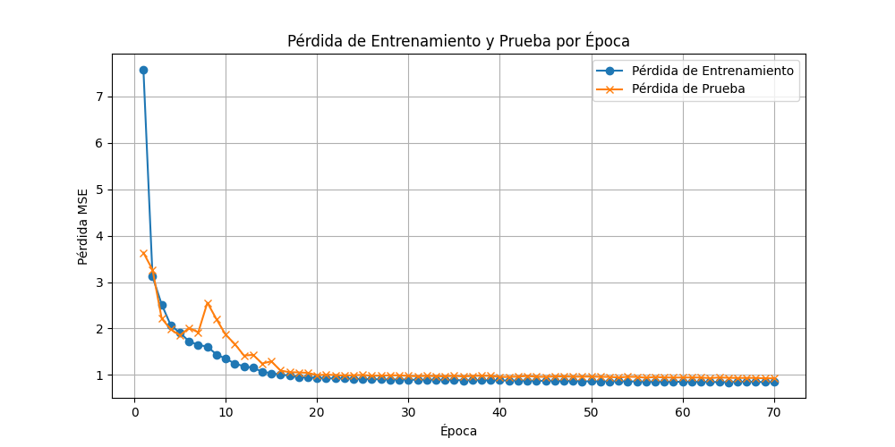

# Sistema de Recomendación de Películas con Autoencoder (SAE)


---

## Índice

- [Introducción](#introducción)
- [Características](#características)
- [Estructura del Proyecto](#estructura-del-proyecto)
- [Datos](#datos)
- [Instalación](#instalación)
- [Uso](#uso)
  - [Entrenamiento del Modelo](#entrenamiento-del-modelo)
  - [Generar Recomendaciones con un Modelo Pre-entrenado](#generar-recomendaciones-con-un-modelo-pre-entrenado)
- [Resultados](#resultados)
  - [Resultados del Entrenamiento](#resultados-del-entrenamiento)
  - [Gráficos Generados](#gráficos-generados)
- [Licencia](#licencia)

---

## Introducción

Este proyecto implementa un **Sistema de Recomendación** utilizando un **Autoencoder**. Basado en el conjunto de datos **MovieLens 1M** (https://grouplens.org/datasets/movielens/), el sistema es capaz de entrenar un modelo de autoencoder, interactuar con el usuario para recopilar datos personales y valoraciones de películas, y generar recomendaciones personalizadas basadas en sus preferencias.

Cabe destacar que en este ejemplo he utilizado un conjunto de películas relativamente antiguas. En la misma página de GroupLens se encuentran disponibles datasets más actuales, como el de 32M, que incluye tanto series como películas. Sin embargo, este dataset no fue utilizado debido a limitaciones de hardware: al cargar los datos, el uso de memoria RAM excedía la capacidad de mi máquina, a pesar de contar con 32 GB de DDR5. Si planeas escalar este proyecto o trabajar con datasets más grandes, asegúrate de disponer de un equipo con recursos suficientes.

El **Autoencoder** es una red neuronal diseñada para aprender una representación (codificación) eficiente de los datos, típicamente para reducción de dimensionalidad. En este proyecto, se utiliza para modelar las preferencias de los usuarios y generar recomendaciones de películas basadas en estas preferencias.

Recomiendo el curso **"Deep Learning de A a Z: Redes Neuronales en Python desde Cero"** (https://www.udemy.com/course/deeplearning/?couponCode=LETSLEARNNOW) en Udemy, donde adquirí una parte significativa de los conocimientos utilizados en este proyecto.

Además, he consultado los siguientes artículos  para complementar el desarrollo y comprensión técnica del proyecto:

1. https://blog.keras.io/building-autoencoders-in-keras.html
2. https://mccormickml.com/2014/05/30/deep-learning-tutorial-sparse-autoencoder/
3. https://icml.cc/2011/papers/455_icmlpaper.pdf

---

## Características

- **Preprocesamiento de Datos**: Incluye funciones para cargar, limpiar y transformar los datos de MovieLens, así como para incorporar características demográficas de los usuarios.
- **Entrenamiento del Modelo**: Implementa un **Autoencoder** para entrenar y optimizar sus parámetros utilizando mini-batches y técnicas de regularización.
- **Interfaz de Usuario**: Permite que los usuarios ingresen sus datos personales y valoraciones de películas.
- **Generación de Recomendaciones**: Proporciona recomendaciones personalizadas basadas en las preferencias del usuario y sus características demográficas.
- **Documentación Completa**: Incluye un notebook detallado (`sae_paso_a_paso.ipynb`) que explica paso a paso el funcionamiento del modelo.

---

## Estructura del Proyecto

```
-----------/
├── data/
│   └── ml-1m/
│       ├── ratings.dat              
│       ├── movies.dat                
│       ├── users.dat                
│       ├── .Rhistory                
│       ├── README                   
│       ├── test_set.csv              
│       ├── Train_Test_Set_Creation.R 
│       └── training_set.csv         
├── models/
│   └── sae.py                       
├── utils/
│   ├── data_preprocessing.py        
│   └── evaluation.py                 
├── Recommender.py                    
├── main.py                           
├── sae_paso_a_paso.ipynb             
├── README.md                        
├── LICENSE.txt
└── salida.txt
```

---

## Instalación

### **1. Clonar el Repositorio**

Clona este repositorio en tu máquina local:

```bash
git clone https://github.com/moises60/Sistema_de_Recomendacion_de_peliculas_con_Autoencoder.git
cd Sistema_de_Recomendacion_de_peliculas_con_Autoencoder
```

### **Entrenamiento del Modelo**

Para entrenar el modelo Autoencoder, ejecuta el script `main.py`. Este script:

```bash
python main.py
```

**Pasos del Proceso:**

1. **Cargar Datos**: Se cargan las valoraciones, películas y características de usuarios desde los archivos en `data/ml-1m/`.
2. **Preprocesamiento**: Se mapean los IDs de películas, se codifican las características demográficas de los usuarios y se concatenan a las valoraciones.
3. **Crear DataLoaders**: Se crean los `DataLoader` para manejar los datos en mini-batches durante el entrenamiento.
4. **Entrenamiento**: El Autoencoder se entrena durante 70 épocas, optimizando los pesos para minimizar el Error Cuadrático Medio (MSE).
5. **Visualización**: Se genera un gráfico que muestra la pérdida de entrenamiento y prueba a lo largo de las épocas.
6. **Guardar Modelo**: El modelo entrenado se guarda en `models/trained_sae.pth`.
7. **Recomendaciones**: El sistema solicita datos personales y valoraciones al usuario, y genera recomendaciones basadas en el modelo.


---

## Resultados

### **Resultados del Entrenamiento**

Durante el entrenamiento, el modelo Autoencoder muestra una disminución constante en la pérdida tanto en el conjunto de entrenamiento como en el de prueba, indicando que está aprendiendo a reconstruir las valoraciones de manera efectiva. Las pérdidas finales son bajas, lo que sugiere una alta precisión en la reconstrucción de las valoraciones de los usuarios.

**Ejemplo de Pérdidas durante el Entrenamiento:**

```
Época: 1, Pérdida de Entrenamiento: 7.5852, Pérdida de Prueba: 3.6339
Época: 2, Pérdida de Entrenamiento: 3.1185, Pérdida de Prueba: 3.2653
...
Época: 70, Pérdida de Entrenamiento: 0.8483, Pérdida de Prueba: 0.9272
Entrenamiento completado.
Gráfico de pérdida generado y guardado.
Modelo guardado en models/trained_sae.pth
```

### **Gráficos Generados**



---

## Uso del Sistema de Recomendación

Después de entrenar el modelo, el sistema solicita al usuario ingresar sus datos personales y calificar una serie de películas. Basado en estas valoraciones y las características demográficas, el sistema genera una lista de películas recomendadas.

**Ejemplo de Interacción:**

```plaintext
Archivo 'movies.dat' cargado exitosamente.
Películas filtradas según el conjunto de datos.

Por favor, califica las siguientes películas (1-5 estrellas). Si no has visto la película, presiona Enter para omitir.
1. Minnie and Moskowitz (1971): 4
2. Truce, The (1996): 4
...
20. Pleasantville (1998): 4
Valoraciones del usuario obtenidas.

Las siguientes películas son recomendadas para ti:
- Usual Suspects, The (1995) (Crime|Thriller)
- Cold Fever (Á köldum klaka) (1994) (Comedy|Drama)
- Institute Benjamenta, or This Dream People Call Human Life (1995) (Drama)
- Close Shave, A (1995) (Animation|Comedy|Thriller)
- Godfather, The (1972) (Action|Crime|Drama)
- Apple, The (Sib) (1998) (Drama)
- Sanjuro (1962) (Action|Adventure)
- Return with Honor (1998) (Documentary)
- I Am Cuba (Soy Cuba/Ya Kuba) (1964) (Drama)
- Song of Freedom (1936) (Drama)
```

**Licencia MIT**.
